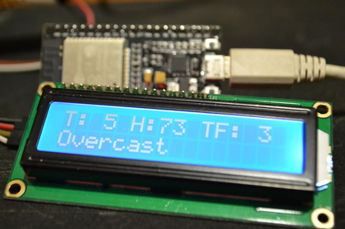

# esp32-weather-station
This weather station based on MCU ESP32 and use LCD display 1602 through I2C adapter PCF8574.
The code developed on [microPython](http://micropython.org/).

# install
* install microPython
* git clone git@github.com:FlintOFF/esp32-weather-station.git
* cp example_config.json config.json
* nano config.json
  * Create acocunt on https://www.apixu.com/ and copy API KEY
  * Write API KEY to "API_KEY"
  * Write your city/country to "CITY" (example "Cherkasy,UA")
  * Fill field "SSID"
  * Fill field "PASSWORD"
  * save end exit
* connect to USB
* rshell --buffer-size=30 -p /dev/ttyUSB0
* cp -r ./lib /pyboard && cp ./config.json /pyboard && cp ./main.py /pyboard && cp ./weather.py /pyboard
* unplug
* connect LCD display to ESP32. 
  * SDA to pin 18
  * SCL to pin 19
  * VCC & GND to external power supply
* done

If you do everything right you will see next text on display

# libs
* [python_lcd](https://github.com/dhylands/python_lcd)
